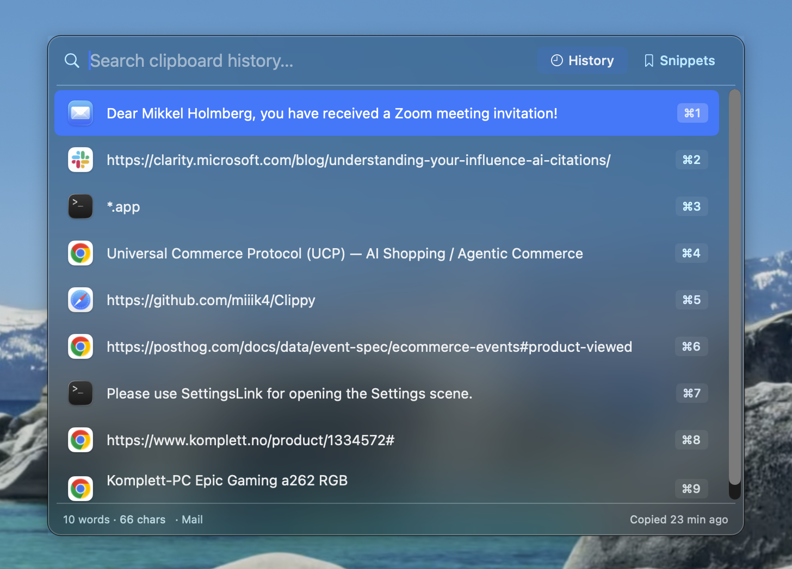
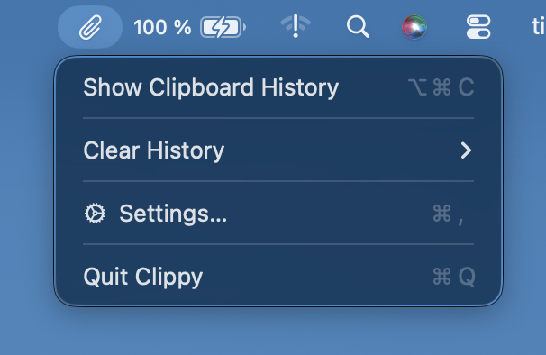
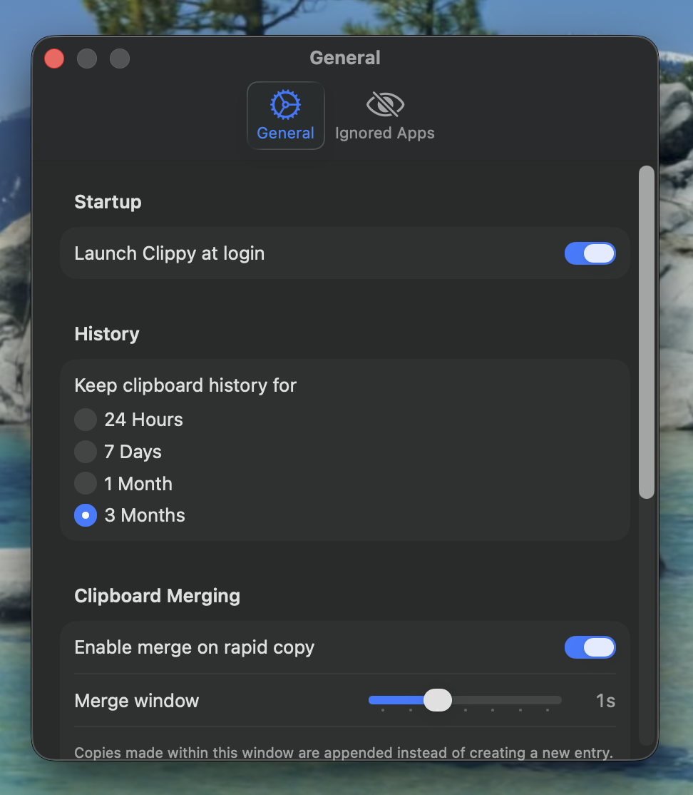

# Clippy

A lightweight clipboard history manager for macOS. Lives in your menu bar, stores everything you copy, and lets you paste any previous item with a quick keyboard shortcut.



## Installation

### Download

1. Go to the [latest release](https://github.com/miiik4/Clippy/releases/latest)
2. Download the `.zip` file
3. Extract it to get the `.dmg` file
4. Open the `.dmg` and drag **Clippy** to your Applications folder
5. The first time you open Clippy, macOS shows a dialog: **"Apple could not verify "Clippy" is free of malware that may harm your Mac or compromise your privacy."** (the app is signed but not yet notarized). To open it anyway:
   1. Click **Done** to dismiss the dialog — do **not** click *Move to Trash*.
   2. Open **System Settings → Privacy & Security** and scroll down to the **Security** section.
   3. You'll see a message that **"Clippy" was blocked to protect your Mac** — click **Open Anyway** next to it.
   4. When the prompt reappears, click **Open Anyway** again and authenticate with Touch ID or your password.

   > On macOS Sequoia (15) and later, the old "right-click → Open" shortcut no longer works for non-notarized apps — you must use the Privacy & Security panel. The **Open Anyway** button only appears for about an hour after you try to launch the app, so if it's missing, double-click Clippy again first.

### Build from source

If you want to verify the code or make your own changes:

1. Clone the repo:
   ```
   git clone https://github.com/miiik4/Clippy.git
   ```
2. Open `Clippy.xcodeproj` in Xcode
3. Select the **Clippy** scheme and your Mac as the run destination
4. Build and run with `⌘R` (or `⌘B` to build only)

No external dependencies — just Xcode 15+ and macOS 14.0 or later.

## Features

- **Clipboard history** — automatically captures text and images (up to 200 items)
- **Global hotkey** — press `⌥⌘V` to open the floating panel from anywhere (customizable in settings)
- **Quick paste** — `⌘1` through `⌘9` to paste recent items, or `Return` to paste selected
- **Click to paste** — single-click an item to select it, double-click to paste it instantly
- **Paste as plain text** — `Shift+Return` to paste without formatting
- **Search** — filter your history instantly by typing
- **Snippets** — save items permanently with `⌘S`, switch with `Tab`
- **Clipboard merging** — rapid successive copies append text instead of creating new entries
- **App ignore list** — skip clipboard captures from password managers and banking apps
- **Sensitive content protection** — text from password managers is masked in the panel and encrypted at rest (key stored in your Keychain), decrypted only in memory when you paste
- **Image preview** — arrow keys to expand/collapse image previews inline
- **Source app icons** — see which app each item was copied from
- **Launch at login** — start Clippy automatically when you log in
- **Automatic updates** — checks for new releases and prompts you from the menu bar when one is available
- **Privacy** — automatically ignores concealed, transient, and auto-generated clipboard data

## Screenshots

| Menu Bar | Settings |
|----------|----------|
|  |  |

## Keyboard Shortcuts

| Action | Shortcut |
|--------|----------|
| Toggle Clippy | `⌥⌘V` |
| Paste item | `⌘1` – `⌘9` |
| Paste selected | `Return` |
| Paste as plain text | `Shift+Return` |
| Save/unsave snippet | `⌘S` |
| Switch History/Snippets | `Tab` |
| Preview image | `→` / `←` |
| Delete item | `fn+Delete` |
| Dismiss | `Escape` |

## Requirements

- macOS 14.0 or later
- Xcode 15+ (if building from source)
